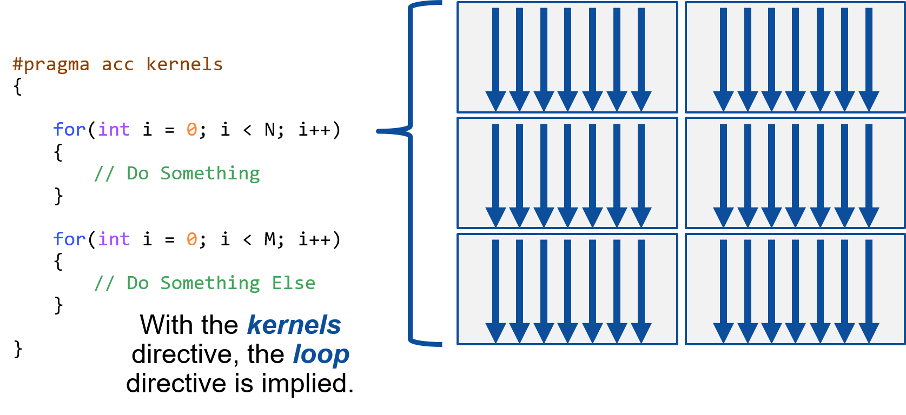
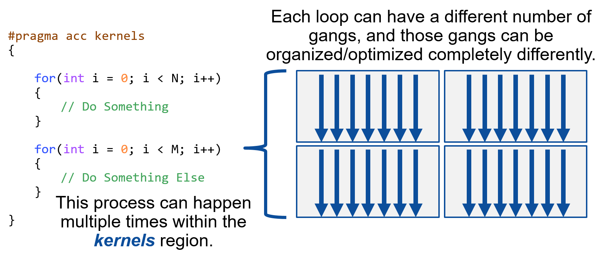

# Using the OpenACC Kernels Directive

In the [main part](README.md) of this lab you learned how to use the `acc parallel loop` directive to accelerate a simple application on multicore CPUs and GPUs. The `acc parallel loop` directive is really nice, because it's simple to understand what it does: it begins parallel execution and it runs the following loop in parallel. This works great if I'm sure I know which loops can and should be parallelized, but what if I'm not sure? As an alternative, OpenACC provides the `acc kernels` directive, which essentially states that the contained region of code is potentially interesting, but needs more analysis. It's then up to the compiler to decide whether the loops in that region can and should be parallelized for the processor you're targeting. Here's how!

## Kernels Directive

The kernels directive allows the programmer to step back, and rely solely on the compiler. Let's look at the syntax:

```cpp
#pragma acc kernels
for (int i = 0; i < N; i++ )
{
    < loop code >
}
```

Just like in the parallel directive example, we are parallelizing a single loop. Recall that when using the parallel directive, it must always be paired with the loop directive, otherwise the code will be improperly parallelized. The kernels directive does not follow the same rule, and in some compilers, adding the loop directive may limit the compilers ability to optimize the code.

As said previously, the kernels directive is the exact opposite of the parallel directive. This means that the compiler is making a lot of assumptions, and may even override the programmers decision to parallelize code. Also, by default, the compiler will attempt to optimize the loop. The compiler is generally pretty good at optimizing loops, and sometimes may be able to optimize the loop in a way that the programmer cannot describe. However, usually, the programmer will be able to achieve better performance by optimizing the loop themself.

If you run into a situation where the compiler refuses to parallelize a loop, you may override the compilers decision. (however, keep in mind that by overriding the compilers decision, you are taking responsibility for any mistakes the occur from parallelizing the code!) In this code segment, we are using the independent clause to ensure the compiler that we think the loop is parallelizable.

```cpp
#pragma acc kernels loop independent
for (int i = 0; i < N; i++ )
{
    < loop code >
}
```

One of the largest advantages of the kernels directive is its ability to parallelize many loops at once. For example, in the following code segment, we are able to effectively parallelize two loops at once by utilizing a kernels region (similar to a parallel region, that we saw earlier.)

```cpp
#pragma acc kernels
{
    for (int i = 0; i < N; i++ )
    {
        < loop code >
    }
    
    < some other sequential code >
    
    for (int j = 0; j < M; j++ )
    {
        < loop code >
    }
}
```

By using the kernels directive, we can parallelize more than one loop (as many loops as we want, actually.) We are also able to include sequential code between the loops, without needing to include multiple directives. Similar to before, let's look at a visual example of how the kernels directive works.




OK, now it's your turn to try the `kernels` approach. Open [laplace2d.c](laplace2d.c) again and replace your `acc parallel loop` directives with `acc kernels` and rerun the code. Don't forget to save the code after making edits.


```bash
$  pgcc -fast -ta=tesla:managed -Minfo=accel -o laplace jacobi.c laplace2d.c && echo "Compilation Successful!" && ./laplace
```

We should see similar performance to the previous version, but for some reason we don't. Let's see if the compiler output tells us anything.

```
calcNext:
     47, Generating implicit copyout(Anew[:])
         Generating implicit copyin(A[:])
     48, Loop carried dependence of Anew-> prevents parallelization
         Loop carried dependence of Anew-> prevents vectorization
         Loop carried backward dependence of Anew-> prevents vectorization
     50, Loop is parallelizable
         Accelerator kernel generated
         Generating Tesla code
         48, #pragma acc loop seq
         50, #pragma acc loop gang, vector(128) /* blockIdx.x threadIdx.x */
         54, Generating implicit reduction(max:error)
```

Hmm, when we used `acc parallel loop` both the loop at line 48 and 50 were parallelized, but now it's telling me that it can't parallelize the one at line 48 because of a data dependency. What gives? Well, this is an example of how the compiler doesn't always get things right. In this case, it's confused by the indexing of the array `Anew` and can't tell for sure whether it's accessed in a manner that is safe to parallelize, so it's cautiously choosing not to parallelize that loop. The compiler needs more information! We said with the `acc parallel loop` directive that the programmer was promising to the compiler that it's safe to parallelize the loop. With the kernels directive, we can do the same things by adding an `acc loop independent` to the loop. This promises to the compiler that the iterations of the loop are independent of each other. Unfortunately, as we said in main lab, this is only true if we do a parallel reduction, so add the `reduction(max:error)` clause too. Your loop should now look like this:

```cpp
double calcNext(double *restrict A, double *restrict Anew, int m, int n)
{
    double error = 0.0;
    #pragma acc kernels
    #pragma acc loop independent reduction(max:error)
    for( int j = 1; j < n-1; j++)
    {
        for( int i = 1; i < m-1; i++ )
        {
            Anew[OFFSET(j, i, m)] = 0.25 * ( A[OFFSET(j, i+1, m)] + A[OFFSET(j, i-1, m)]
                                           + A[OFFSET(j-1, i, m)] + A[OFFSET(j+1, i, m)]);
            error = fmax( error, fabs(Anew[OFFSET(j, i, m)] - A[OFFSET(j, i , m)]));
        }
    }
    return error;
}
```

You'll need to add `acc loop independent` to the loop nest in the `swap` function as well. Once you've done that, save your work, recompile, and run the code again. You should now see the performance back where it was previously. If the performance or answers look wrong, feel free to take a peek at [our solution](solutions/laplace2d.kernels.c). After fixing the code, be sure to build and run it again.


```bash
$  pgcc -fast -ta=tesla:managed -Minfo=accel -o laplace jacobi.c laplace2d.c && echo "Compilation Successful!" && ./laplace
```

## Conclusions

Let's recap the two approaches OpenACC provides for parallelizing your application.

* The `parallel loop` directive gives a lot of control to the programmer. The programmer decides what to parallelize, and how it will be parallelized. Any mistakes made by the parallelization is at the fault of the programmer. It is recommended to use a `parallel loop` directive for each loop you want to parallelize.

* The `kernels` directive leaves majority of the control to the compiler. The compiler will analyze the loops, and decide which ones to parallelize. It may refuse to parallelize certain loops, but the programmer can override this decision. You may use the kernels directive to parallelize large portions of code, and these portions may include multiple loops.

So which approach should you use in your application? It's really mostly personal preference. The `kernels` directive is nice because when it works properly, it requires very little thought by the programmer. But if the compiler is at all unsure about whether a loop is safe to parallelize, it will not parallelize that loop. On the other hand, the compiler will always parallelize loops with the `parallel loop` directive because the programmer has promised that it's safe to do so. At the end of the day, for most loops, it's possible to get very similar performance using either approach, so you should use the one that you feel most comfortable and productive with.
